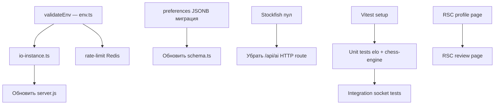

# Архитектурный план — JustChess

## 1. Замена `global.io` → явный синглтон `io-instance.ts`

### Проблема
В [`server.js:51`](../server.js) присваивается `global.io = io`, что делает `io` неявной глобальной зависимостью без типизации.

### Решение — `src/server/socket/io-instance.ts`

```ts
// src/server/socket/io-instance.ts
import type { AppServer } from "./index";

let _io: AppServer | null = null;

export function setIO(io: AppServer): void {
  _io = io;
}

export function getIO(): AppServer {
  if (!_io) throw new Error("[io-instance] Socket.IO не инициализирован");
  return _io;
}
```

### Изменения в `server.js`

```js
// Убрать: global.io = io;
// Добавить (после require):
const { setIO } = require("./src/server/socket/io-instance");
// После registerSocketHandlers(io):
setIO(io);
```

### Где используется `global.io`
Поиск по проекту: заменить все вхождения `global.io` на `getIO()` в API routes (например, [`src/app/api/games/[id]/move/route.ts`](../src/app/api/games/[id]/move/route.ts)).

```
grep -r "global.io" src/
```

---

## 2. Redis для Rate Limiter

### Проблема
[`src/lib/rate-limit.ts`](../src/lib/rate-limit.ts) использует только `RateLimiterMemory` — не масштабируется при нескольких воркерах/инстансах.

### Решение — условный выбор через `REDIS_URL`

```ts
// src/lib/rate-limit.ts
import { RateLimiterMemory, RateLimiterRedis } from "rate-limiter-flexible";
import { createClient } from "redis";

type AnyLimiter = RateLimiterMemory | RateLimiterRedis;

function createLimiter(opts: {
  points: number;
  duration: number;
  keyPrefix: string;
}): AnyLimiter {
  if (process.env.REDIS_URL) {
    const redisClient = createClient({ url: process.env.REDIS_URL });
    redisClient.connect().catch(console.error);
    return new RateLimiterRedis({ storeClient: redisClient, ...opts });
  }
  return new RateLimiterMemory(opts);
}

export const apiLimiter    = createLimiter({ points: 100, duration: 60,      keyPrefix: "api" });
export const authLimiter   = createLimiter({ points: 10,  duration: 900,     keyPrefix: "auth" });
export const moveLimiter   = createLimiter({ points: 60,  duration: 60,      keyPrefix: "move" });
export const friendLimiter = createLimiter({ points: 20,  duration: 3600,    keyPrefix: "friend" });
```

### Зависимости
```
npm install redis
```
`rate-limiter-flexible` уже поддерживает Redis-адаптер.

### Переменная окружения
```
REDIS_URL=redis://localhost:6379  # опционально, без неё — memory
```

---

## 3. Валидация env через Zod — `src/lib/env.ts`

### Все переменные проекта (из `.env.local`, `server.js`, `render.yaml`)

```ts
// src/lib/env.ts
import { z } from "zod";

const envSchema = z.object({
  // Server
  NODE_ENV:              z.enum(["development", "production", "test"]).default("development"),
  PORT:                  z.coerce.number().default(3000),
  HOSTNAME:              z.string().default("0.0.0.0"),

  // Database
  DATABASE_URL:          z.string().url(),

  // Auth (Better-Auth)
  BETTER_AUTH_SECRET:    z.string().min(32),
  BETTER_AUTH_URL:       z.string().url(),

  // App
  NEXT_PUBLIC_APP_URL:   z.string().url().default("http://localhost:3000"),

  // Redis (опционально)
  REDIS_URL:             z.string().url().optional(),
});

export type Env = z.infer<typeof envSchema>;

let _env: Env;

export function validateEnv(): Env {
  const result = envSchema.safeParse(process.env);
  if (!result.success) {
    console.error("[env] Ошибка конфигурации:\n", result.error.format());
    process.exit(1);
  }
  _env = result.data;
  return _env;
}

export function env(): Env {
  if (!_env) throw new Error("[env] validateEnv() не вызван");
  return _env;
}
```

### Вызов при старте в `server.js`

```js
const { validateEnv } = require("./src/lib/env");
validateEnv(); // первой строкой после dotenv.config()
```

---

## 4. Preferences как JSONB

### Текущее состояние
В [`src/db/schema.ts:110`](../src/db/schema.ts) поле `preferences` — `text` с JSON-строкой.

### Новый TypeScript-тип

```ts
// src/db/schema.ts (добавить перед таблицей users)
export type PreferencesData = {
  theme:               "system" | "light" | "dark";
  boardTheme:          "classic" | "wood" | "green" | "blue";
  pieceSet:            "standard" | "neo" | "alpha";
  soundEnabled:        boolean;
  showCoordinates:     boolean;
  autoPromoteToQueen:  boolean;
};

export const DEFAULT_PREFERENCES: PreferencesData = {
  theme: "system",
  boardTheme: "classic",
  pieceSet: "standard",
  soundEnabled: true,
  showCoordinates: true,
  autoPromoteToQueen: false,
};
```

### Изменение схемы Drizzle

```ts
// Добавить в импорты drizzle-orm/pg-core:
import { jsonb } from "drizzle-orm/pg-core";

// В таблице users, поле preferences:
preferences: jsonb("preferences")
  .$type<PreferencesData>()
  .default(DEFAULT_PREFERENCES),
```

### Миграция SQL

```sql
-- drizzle/migrations/XXXX_preferences_jsonb.sql
ALTER TABLE users
  ALTER COLUMN preferences TYPE jsonb
  USING preferences::jsonb;

ALTER TABLE users
  ALTER COLUMN preferences SET DEFAULT
  '{"theme":"system","boardTheme":"classic","pieceSet":"standard","soundEnabled":true,"showCoordinates":true,"autoPromoteToQueen":false}'::jsonb;
```

Команда для генерации: `npx drizzle-kit generate`

---

## 5. Стратегия тестирования

### Инструменты
- **Vitest** (рекомендован для Next.js проектов — быстрее Jest, нативный ESM)
- **@testing-library/react** для компонентов
- **socket.io-mock** или реальный `socket.io-client` для интеграционных тестов

### Unit-тесты

| Файл | Что тестировать |
|------|----------------|
| [`src/lib/elo.ts`](../src/lib/elo.ts) | Расчёт рейтинга: победа/поражение/ничья, граничные значения K-фактора |
| [`src/lib/chess-engine.ts`](../src/lib/chess-engine.ts) | Валидация ходов, определение мата/пата, FEN-парсинг |
| [`src/services/game.service.ts`](../src/services/game.service.ts) | createGame, makeMove, resignGame — с mock db через vitest.mock |

### Интеграционные тесты (Socket handlers)

```
src/server/socket/handlers/__tests__/
  game.handler.test.ts      # game:join, game:move, game:resign
  lobby.handler.test.ts     # lobby:create, lobby:join, matchmaking
```

**Паттерн**: поднять реальный `http.Server` + `socket.io` на случайном порту, подключить `socket.io-client`, проверить эмиттированные события.

### Конфигурация `vitest.config.ts`

```ts
import { defineConfig } from "vitest/config";
import tsconfigPaths from "vite-tsconfig-paths";

export default defineConfig({
  plugins: [tsconfigPaths()],
  test: {
    environment: "node",
    globals: true,
    coverage: { provider: "v8", reporter: ["text", "lcov"] },
  },
});
```

---

## 6. Архитектура Stockfish на сервере (worker_threads пул)

### Проблема
Текущий [`src/workers/stockfish.worker.ts`](../src/workers/stockfish.worker.ts) — браузерный Web Worker (WASM через CDN/importScripts). Для серверного AI-хода нужен Node.js `worker_threads` с `stockfish` npm-пакетом.

### Зависимости
```
npm install stockfish     # содержит stockfish.js для Node.js
```

### Проектируемая структура

```
src/server/stockfish/
  stockfish-pool.ts        # пул worker_threads, публичный API
  stockfish-worker.ts      # код внутри каждого worker thread
```

### `stockfish-worker.ts` (код потока)

```ts
// src/server/stockfish/stockfish-worker.ts
import { parentPort } from "worker_threads";
import Stockfish from "stockfish";

const engine = Stockfish();
engine.onmessage = (line: string) => {
  if (line.startsWith("bestmove")) {
    const move = line.split(" ")[1];
    parentPort?.postMessage({ type: "bestmove", move });
  }
};

engine.postMessage("uci");

parentPort?.on("message", ({ fen, depth, skillLevel }: {
  fen: string; depth: number; skillLevel: number;
}) => {
  engine.postMessage("ucinewgame");
  engine.postMessage(`setoption name Skill Level value ${skillLevel}`);
  engine.postMessage(`position fen ${fen}`);
  engine.postMessage(`go depth ${depth}`);
});
```

### `stockfish-pool.ts` (пул)

```ts
// src/server/stockfish/stockfish-pool.ts
import { Worker } from "worker_threads";
import path from "path";

const POOL_SIZE = Math.max(2, Math.floor(require("os").cpus().length / 2));

interface PoolWorker {
  worker: Worker;
  busy: boolean;
}

const pool: PoolWorker[] = [];

export function initStockfishPool(): void {
  for (let i = 0; i < POOL_SIZE; i++) {
    const worker = new Worker(
      path.resolve(__dirname, "./stockfish-worker.js")
    );
    pool.push({ worker, busy: false });
  }
}

export function getBestMove(fen: string, depth: number, skillLevel: number): Promise<string> {
  return new Promise((resolve, reject) => {
    const slot = pool.find(p => !p.busy);
    if (!slot) return reject(new Error("Все Stockfish workers заняты"));

    slot.busy = true;
    slot.worker.once("message", ({ move }) => {
      slot.busy = false;
      resolve(move);
    });
    slot.worker.once("error", (err) => {
      slot.busy = false;
      reject(err);
    });
    slot.worker.postMessage({ fen, depth, skillLevel });
  });
}
```

### Интеграция в `game.handler.ts`

В обработчике AI-хода вместо HTTP-вызова `/api/ai`:
```ts
import { getBestMove } from "@/server/stockfish/stockfish-pool";
// ...
const move = await getBestMove(currentFen, depth, skillLevel);
```

### Вызов `initStockfishPool()` в `server.js` после `app.prepare()`

---

## 7. Server Components — план конвертации

### Критерии конвертации
Страница подходит для Server Component если:
- Нет `useState`/`useEffect`/клиентских хуков
- Данные можно получить на сервере (через `db` напрямую или `fetch`)
- Нет подписки на Socket.IO события

### Анализ целевых страниц

| Страница | Текущий статус | Конвертируемость | Стратегия |
|----------|---------------|-----------------|-----------|
| [`/profile/[id]`](../src/app/profile/[id]/page.tsx) | `"use client"` (732 строки) | ✅ Возможно | Shell → RSC, интерактивные части → Client |
| [`/game/[id]/review`](../src/app/game/[id]/review/page.tsx) | Нужно проверить | ✅ Возможно | Данные игры на сервере, шахматная доска — Client |
| [`/friends`](../src/app/friends/page.tsx) | `"use client"` | ⚠️ Частично | Список друзей → RSC, online-статус → Client polling |

### Детальный план для `/profile/[id]`

```
app/profile/[id]/
  page.tsx                  # RSC: fetchUser, fetchStats, fetchAchievements
  ProfileClientShell.tsx    # "use client": табы, интерактивность
  AchievementsList.tsx      # RSC: статический список
  RecentGames.tsx           # RSC: последние игры (первая страница)
  RecentGamesPaginated.tsx  # "use client": пагинация
```

**RSC `page.tsx`**:
```ts
// app/profile/[id]/page.tsx (Server Component)
import { db } from "@/db";
import { users } from "@/db/schema";
import { eq } from "drizzle-orm";

export default async function ProfilePage({ params }: { params: { id: string } }) {
  const user = await db.query.users.findFirst({ where: eq(users.id, params.id) });
  // ...
  return <ProfileClientShell user={user} />;
}
```

### Детальный план для `/game/[id]/review`

```
app/game/[id]/review/
  page.tsx                  # RSC: fetchGame + все ходы
  ReviewClientBoard.tsx     # "use client": навигация по ходам, chess-board
```

### Детальный план для `/friends`

Онлайн-статус друзей обновляется через Socket.IO — страницу нельзя полностью перевести в RSC. Рекомендуется гибридный подход:
- Список друзей (имена, аватары) — RSC
- Online-индикаторы — отдельный Client Component с polling или Socket подпиской

---

## Порядок реализации (приоритеты)



1. `env.ts` — блокирует всё, безопасность
2. `io-instance.ts` — убирает глобальное состояние
3. `rate-limit.ts` Redis — масштабируемость
4. `schema.ts` JSONB + миграция — чистота данных
5. Stockfish пул — производительность AI
6. RSC конвертация — SEO и производительность загрузки
7. Тесты — покрытие критических модулей
